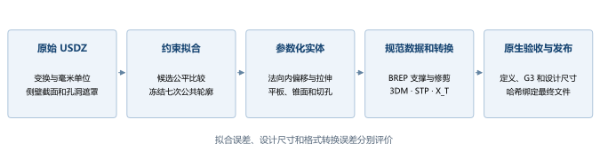

# 项目方案与运行流程

## 项目要解决的问题

项目从两个 USDZ 资产中提取金属机身的侧壁轮廓，把离散多边形观测转成具有明确光顺条件的数学曲线，再生成无孔模型和带接口的壳体、底座。最终的外轮廓不是圆角矩形中的圆弧，而是四段七次 Bézier 圆角与四段直线组成的闭合曲线。

两类模型已经合并为一个项目。对同一个机型，无孔系列与带接口系列读取同一份 `data/fitted_profiles.json`；Mini 和 Studio 各自具有独立参数，不能互相替代。“共享曲线”指同一机型在不同系列间共享定义，不是把两款不同尺寸的产品强制使用同一条曲线。

方案分成三个职责清楚的阶段。第一阶段只判断源网格所支持的侧壁形状。第二阶段把已接受曲线缩放到公称宽度，依据用户指定的高度、厚度、锥角和开孔规则建立实体。第三阶段冻结实体母版，对每种使用格式做原生回读和定义比较，全部通过后才发布。



## 输入和可信依据

| 输入 | 作用 | 权威文件 |
|---|---|---|
| 原始 USDZ | 侧壁网格、接口边界及可追溯的源观测 | `data/input` |
| 拟合协议 | 高度分组、遮罩距离、候选模型和选择门槛 | `configs/protocol.json` |
| 机型配置 | 源文件指纹、壳体 Prim、基准曲线和切点先验 | `configs/models.json` |
| 已接受拟合报告 | 最终候选、原始尺度控制点与误差 | `results/fitting/reference` |
| 公称外轮廓 | 全部当前实体采用的完整精度控制点 | `data/fitted_profiles.json` |
| 用户指定设计规则 | 现行锥角、孔径、孔距、数量计算规则 | `data/enclosure_design.json` |
| 每个版本的参数 | 高度、坐标系、接口边界和底座定义 | `results/masters/*/enclosure-*mm/model_parameters.json` |
| 冻结母版与规范数据 | 实际交付的支撑、修剪与拓扑定义 | BREP 及发布清单引用的 `canonical.geometry.json` |

源文件 SHA-256 用于识别输入变化。它证明文件身份，不证明原模型等于实物。当前没有引入新的实体测量；正方形、四角共形、中段直线拉伸等属于已选择的设计假设。

历史拟合报告中的“参考侧壁没有布尔开孔”描述的是第一阶段的拟合参考面。当前带接口的正式实体已经在第二阶段完成真实切孔。不能把参考面的说明套用到最终壳体。

## 坐标系和尺度

拟合读取的源资产为 Y-up。代码应用完整父级变换，按照 `metersPerUnit × 1000` 转成毫米。源世界坐标记作 $\mathbf{x}_w=(X_w,Y_w,Z_w)$，拟合平面坐标为 $x=X_w-c_x$、$y=Z_w-c_z$；源高度使用 $Y_w$。截面拟合前仅平移中心，不分别拉伸 X 与 Z。

公称化采用统一水平比例 $\lambda=W_{nominal}/W_{fit}$，把拟合控制点同时乘以 $\lambda$。当前公称宽度为 Mini 127 mm、Studio 197 mm。用于源拟合的中段高度与最终装配高度是两套定义，最终高度来自设计要求。

最终 CAD 使用 Z-up，XY 中心位于机身轮廓中心，底座底面为 Z=0。带接口的 Mini 壳体位于 Z=6.5 至 49.5 mm；Studio 壳体位于 Z=8.5 至 95.0 mm。底座大平板下表面与壳体下边界重合，顶面深入壳体 1.5 mm。

<!-- BEGIN DIMENSIONS -->
| 机型 | 外宽 mm | 壳体高 mm | 底座高 mm | 嵌入 mm | 装配高 mm | 底座锥角 |
| --- | --- | --- | --- | --- | --- | --- |
| Mini | 127 | 43 | 8 | 1.5 | 49.5 | 45° |
| Studio | 197 | 86.5 | 10.0 | 1.5 | 95.0 | 30° |
<!-- END DIMENSIONS -->

无孔系列的原高度实心体分别为 Mini 50 mm、Studio 95 mm；另有总高 1 mm 的实心薄片和 2/3 mm 壁厚的无孔壳体。这里 Mini 50 mm 的无孔参考体与 49.5 mm 的带接口装配是保留的两个不同交付定义。

## 当前三维建模方案

外侧面沿公共轮廓竖直拉伸。内轮廓来自外轮廓的真实单位法向偏移，并以七次 B 样条存储；壳体顶部保留平板，底部开口。Mini 内腔延伸至壳体底面，内底缘没有额外环形台阶。

底座由平板与平行圆锥支撑组成。上下平板厚度和圆锥壁法向厚度均为 1.5 mm，不随 2/3 mm 壳体版本改变。内锥面直接延伸到上下平板；交界延长区允许局部增厚。底座上部的外轮廓与相应壳体内轮廓一致，因此两种壳体厚度对应不同的配合外圈。Studio 朝桌面的底板与底座为同一实体，两款均没有脚垫或支撑垫圈。

Mini 底座锥面采用 108 个法向长圆孔。Studio 底座采用 8 圈等高圆柱孔，背面采用从展开平面映射孔心的交错阵列。所有圆孔的轴线取孔心处的曲面法线，孔壁半径在整个孔深内保持 0.75 mm。侧接口来自保留的参数化源边界；Studio 前后 14 个接口使用纠正后的左右顺序。

数学定义和具体参数见 [精确数学定义](03_MATHEMATICS.md)。板、锥面和开孔相交处可以有设计折边；G3 要求仅覆盖指定的轮廓与侧壁接缝。

## 代码如何协作

| 模块 | 实际职责 |
|---|---|
| `macfit/io.py` | USD 读取、世界变换、单位及文件指纹 |
| `macfit/geometry.py` | 截面、开孔遮罩、B 样条、最近距离、解析曲率 |
| `macfit/fitting.py` 与 `pipeline.py` | 受约束优化、公平比较、候选选择、冻结报告 |
| `macfit/height.py` 与 `verification.py` | 高度变化诊断、导数和参考 3DM 核验 |
| `tools/shared_profiles.py` | 统一外轮廓的加载与实体支撑一致性检查 |
| `enclosure/wall_offset.py` | 内偏移曲线及其误差、有效性检查 |
| `enclosure/current_design.py` | 将最新要求与机型参数组合为重建定义 |
| `enclosure/studio_rear_pattern.py` | 展开平面错列孔心及贴合规则 |
| `enclosure/studio_base_pattern.py` | 水平孔圈、锥面法线和实际孔心回算 |
| `enclosure/mini_capsules.py` | 长圆孔的两段半圆、两条直线及法向切割 |
| `tools/rebuild_bottom_revision.py` | Mini 及通用装配的暂存构建 |
| `tools/rebuild_studio_base.py` | 共用带孔锥体核心，加两种配合外圈 |
| `tools/exact_*.py` | 规范数据、母版边界校正、严格转换、验收和发布 |
| `tools/exact_native` | Rhino 与 SolidWorks 原生进程内读写适配器 |
| `project.py` | 统一的检查、构建、导出及清单入口 |

## 文件组织与日常操作

`results/3DM`、`results/STP`、`results/X_T` 各有 20 个使用文件。`results/masters` 保存 20 个 BREP 母版及参数、孔位表和设计验收。`results/3DM/reference` 中另有 20 个仍有效的参考曲线文件；这些不是多余的旧实体。STEP 只使用 `.stp` 后缀，`.step` 表示同一种格式，不重复交付。

从项目根目录执行以下检查，不会重新拟合或重新生成模型：

```powershell
python -B project.py verify
python -B project.py fit-check
python -B project.py files
```

需要从最终 BREP 重新测量设计约束时执行下列命令。它会更新尺寸和孔道验收报告，耗时高于哈希核验：

```powershell
python -B project.py verify --refresh-design-audits
```

重新拟合属于新的数值实验，输出到独立工作目录，不覆盖已接受的拟合参考：

```powershell
python -B -m macfit run --model both --output .tmp/refit
```

重新生成所有现行实体可使用 `python -B project.py build --family all`。构建入口会生成候选母版、执行三格式验收并发布，最后刷新设计验收。单独的 `project.py export` 对已登记候选执行转换和发布；若当前文件已经具有有效证据，则复用核验合格的记录。单独修改 Studio 背孔与底座可使用 `python -B tools/rebuild_studio_base.py --rebuild-housing`，随后刷新设计验收。

大量孔的布尔运算、BREP 有效性检查及原生定义读取都可能较慢。Studio 构建通过共用孔圈核心、两种交错排带和已验收装配零件减少重复工作；仍需检查完整实体。运行时的 `.tmp` 是可重建工作目录，发布后的正式模型和最终证据不依赖它。

## 修改和版本边界

改变拟合损失、观测筛选或候选集合会产生新拟合实验；改变孔径、锥角或高度会产生新实体母版；改变导出表示则需要新格式验收。文档和图表的更新本身不算重新回读 CAD。

当前清理依据是“是否符合最新需求、是否仍是必要输入或证据”。文件日期不参与这一判断。正式发布后保留当前母版、源资产、有效参考、程序、依赖和验收记录；被替代的模型、重复输出及可再生成的缓存可以清理。

依据：[现行设计规则](../../data/enclosure_design.json)、[发布清单](../../exact_delivery_manifest.json)、[统一入口](../../project.py)、[建模约定](../MODELING_NOTES.md)。
