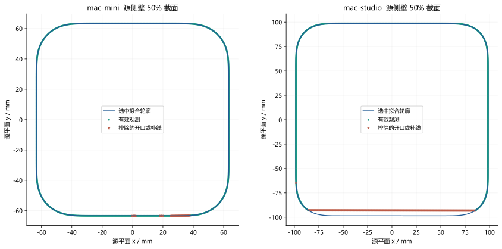
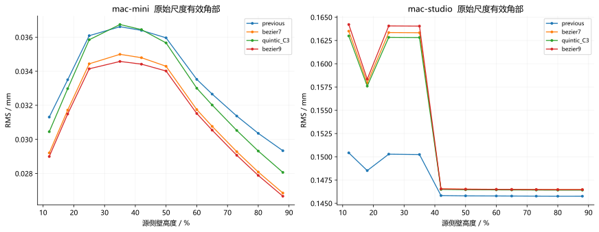
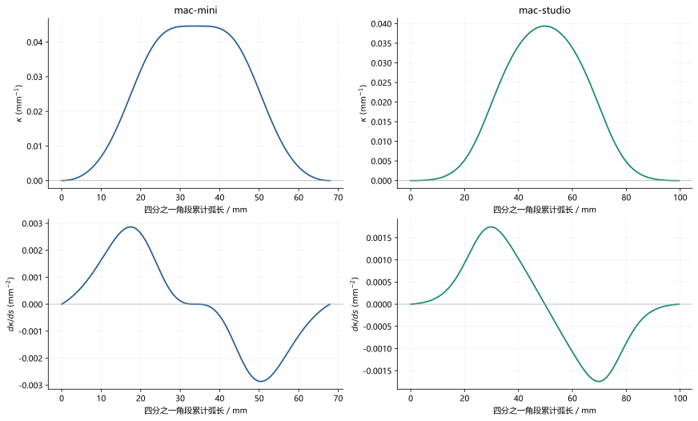

# 拟合方法与结果

## 从多边形资产构造观测

项目选择配置中明确指定的金属侧壁 Prim。底座、内部组件和其他独立零件不混入轮廓拟合。读取时检查源文件指纹、网格索引、可见性、静态属性和非细分多边形条件；当前协议只接受已配置的 Y-up 资产。

先排除侧壁顶部与底部各 10% 的高度。保留区域内使用 11 个互不重复的水平截面：训练 18%、35%、65%、88%；验证 25%、50%、80%；测试 12%、42%、60%、73%。百分数以源金属侧壁的最低和最高 Y 坐标定义。

每个截面直接与原始多边形求交，保留相交线段和源面编号。凸包只给出闭合采样路径，每圈等弧长取 960 点。对于采样点 $\mathbf{q}$，只有它到真实相交线段集合 $\mathcal{S}$ 的距离不超过 0.002 mm，才具有源表面支持：

$$d_{seg}(\mathbf{q},\mathcal{S})=\min_{[\mathbf{a},\mathbf{b}]\in\mathcal{S}}\min_{0\leq u\leq1}\|\mathbf{q}-[(1-u)\mathbf{a}+u\mathbf{b}]\|\leq0.002\ \mathrm{mm}.$$

源网格顶点仅在识别拓扑时按 0.0001 mm 舍入焊接。只出现一次的网格边构成边界环；除上下口沿外，开孔或缺失面板在相应侧向平面中投影。投影内部和距边界 0.25 mm 的保护带均被排除。这样，穿过孔洞的凸包连线不会变成虚构的机身观测。

报告中 `all_hull` 包括完整凸包采样，`supported` 只保留有效外表面，`supported_corner` 进一步限定到角部。本文拟合 RMS 和最大残差均注明评价口径，不能将排除区域的补线误差混入有效角部后，再与另一候选使用不同数据比较。

源 Studio 的 15 条开口或面板边界属于拟合遮罩分类，其中包括面板边界；它不是当前实体 14 个功能接口的计数。背面通风阵列则来自当前设计规则另行生成。

## 候选曲线和设计约束

候选为七次 Bézier 基准、优化七次 Bézier、两段五次 C3 B 样条和单段九次 Bézier。七次和九次采用端点全重节点；五次样条在 0.5 处设置二重内节点，因此内连接的连续性为 $C^{5-2}=C^3$。

先在第一象限构造一段从上边到右边的曲线，再利用对称关系构造其余部分。正方形半宽 $h$ 为固定值，切点横坐标 $a$ 为优化参数。若控制点数量为 $n$，代码用 softmax 将自由参数变成正增量：

$$w_j=\frac{e^{\eta_j}}{\sum_{k=0}^{n-5}e^{\eta_k}},\qquad j=0,\ldots,n-5,\qquad\eta_{n-5}=0.$$

$$x_0=a,\qquad x_i=a+(h-a)\sum_{j=0}^{i-1}w_j\quad(1\leq i\leq n-5).$$

$$x_{n-4}=x_{n-3}=x_{n-2}=x_{n-1}=h,\qquad\mathbf{P}_i=(x_i,x_{n-1-i}).$$

对七次曲线 $n=8$，实际是切点与三个 softmax 自由参数。首尾各四个控制点共线，对角对称由控制点排列直接保证。只要端点速度非零，这一结构使两端曲率及曲率对弧长的一阶导数为零，从而与相邻直线满足指定 G3 条件。严格定义与推导见 [数学定义](03_MATHEMATICS.md)。

训练时将有效观测折叠到第一象限，保留 $\min(|x|,|y|)>0.28h$ 的点，并每隔一个取样。候选评价统一使用 $\min(|x|,|y|)>0.38h$ 的有效角部。训练筛选与评价筛选不相同，但所有候选各自使用同一套训练和评价规则。

## 最近距离和目标函数

到候选曲线的距离包括角段及它的两条相邻直线。对观测点 $\mathbf{q}_i$，定义 $\mathcal{G}_{\theta}$ 为这个第一象限轮廓集合：

$$d_i(\theta)=\min_{\mathbf{x}\in\mathcal{G}_{\theta}}\|\mathbf{q}_i-\mathbf{x}\|.$$

实际最近点求解先在 257 个曲线参数上用 KD 树找初值，再迭代七次受限 Newton 更新。最终选中模型还在粗网格邻域内做有界一维精修，并与独立密采样距离交叉检查。因此这些残差是高精度数值结果，不是连续区间 Hausdorff 距离的形式化证明。

记四分之一曲线为 $\mathbf{C}(t)$，速度为 $v(t)=\|\mathbf{C}'(t)\|$，$\kappa_s=d\kappa/ds$。当前代码优化的目标为：

$$J(\theta)=\frac{1}{N}\sum_{i=1}^{N}\rho(d_i)+\lambda_E E+\lambda_a\left(\frac{a-a_0}{3\ \mathrm{mm}}\right)^2.$$

$$\lambda_E=\lambda_a=10^{-5}\ \mathrm{mm}^2.$$

$$\rho(d)=2\delta^2\left(\sqrt{1+(d/\delta)^2}-1\right),\qquad\delta=0.03\ \mathrm{mm}.$$

$$E=\int_{0.0001}^{0.4999}(h^2\kappa_s(t))^2\frac{v(t)}{h}\,dt.$$

代码固定以毫米作为长度数值单位，式中的两个系数给出与现行数值实现一致的量纲：$E$ 和切点先验项均无量纲，$J$ 与 $\rho$ 的单位为平方毫米。改变长度单位时必须相应换算系数与长度常量。$a_0$ 是配置中的切点先验；$E$ 在 180 个均匀参数点上用梯形积分离散。稳健损失降低大残差的权重；曲率变化项抑制不必要的起伏；切点先验只提供很弱的稳定作用，不是测量得到的置信区间。

在同一组 180 个前半段参数点上施加 $h\kappa\geq0$、$h^2\kappa_s\geq0$、$v/h\geq0.10$。七次曲线凭结构满足端点 G3，凸性、速度和前半段曲率单调性则另行数值检查。求解器为 SLSQP，三个不同切点初值、最多 250 次迭代、目标容差 $2\times10^{-11}$；softmax 自由参数限制为 [-3,3]。优化后再检查 4001 个前半段参数点，最终参考验收使用 16001 个全段点。

这些密采样检查不能改写成“已对所有实数参数证明曲率单调”。本项目给出了端点 G3 的代数依据，整体单调性保留数值验收口径。

## 候选如何选出

测试集不参与选择。先排除优化失败的候选、相对基准单向密采样移动达到 0.15 mm 的候选，以及验证最大残差较基准增加超过 0.005 mm 的候选。然后在最低验证 RMS 的 1% 范围内，依次选择控制点更少、次数更低、验证 RMS 更小的候选。

Mini 的九次候选验证 RMS 略低，但七次与其差距在 1% 内，因此采用八个控制点的七次曲线。Mini 切点达到搜索下界，说明该参数对先验范围敏感，不能将当前切点视作被源网格唯一识别出的实物切点。

Studio 选中的轮廓为七次 Bézier 基准，验证 RMS 约为 0.147563 mm，验证最大残差约为 0.194237 mm。各候选在相同数据和选择门槛下的评价如下。

<!-- BEGIN CANDIDATES -->
| 机型 | 候选 | 次数 | 控制点数 | 验证 RMS mm | 验证最大 mm | 测试 RMS mm |
| --- | --- | --- | --- | --- | --- | --- |
| mac-mini | 七次 Bézier 基准 | 7 | 8 | 0.034171725 | 0.078698037 | 0.033129057 |
| mac-mini | 优化七次 Bézier（选中） | 7 | 8 | 0.032331543 | 0.073675851 | 0.031245882 |
| mac-mini | 五次 C3 B 样条 | 5 | 8 | 0.033669663 | 0.077739575 | 0.032594175 |
| mac-mini | 九次 Bézier | 9 | 10 | 0.032073240 | 0.072590401 | 0.030987447 |
| mac-studio | 七次 Bézier 基准（选中） | 7 | 8 | 0.147563347 | 0.194237315 | 0.147202819 |
| mac-studio | 优化七次 Bézier | 7 | 8 | 0.153323731 | 0.292933387 | 0.151819066 |
| mac-studio | 五次 C3 B 样条 | 5 | 8 | 0.153074451 | 0.289195489 | 0.151612291 |
| mac-studio | 九次 Bézier | 9 | 10 | 0.153616336 | 0.296777518 | 0.152044417 |
<!-- END CANDIDATES -->

以上候选表对应原始拟合尺度的有效角部。选中模型做了最终精修评价，未选中的候选保留选择阶段评价结果；不要把表格中的末位差异理解为无限精度排序依据。

## 当前结果的误差

对一组有效残差 $d_i$，定义：

$$\mathrm{RMS}=\sqrt{\frac{1}{N}\sum_{i=1}^{N}d_i^2},\qquad d_{max}=\max_i d_i.$$

公称尺度下若观测和曲线都乘以同一个 $\lambda$，则 $d_i^{nominal}=\lambda d_i^{raw}$。下表同时给出原始拟合与一致缩放后的公称结果。不能把只缩放曲线、不缩放观测的误差当作同一个指标。

<!-- BEGIN FIT_RESULTS -->
| 机型 | 分组 | 有效角部点数 | 原始 RMS mm | 原始最大 mm | 公称 RMS mm | 公称最大 mm |
| --- | --- | --- | --- | --- | --- | --- |
| mac-mini | 训练 | 2189 | 0.031094821 | 0.073676874 | 0.031169628 | 0.073854122 |
| mac-mini | 验证 | 1632 | 0.032331543 | 0.073675851 | 0.032409324 | 0.073853096 |
| mac-mini | 测试 | 2199 | 0.031245882 | 0.073676594 | 0.031321051 | 0.073853841 |
| mac-studio | 训练 | 1954 | 0.147794580 | 0.194243370 | 0.147736716 | 0.194167320 |
| mac-studio | 验证 | 1447 | 0.147563347 | 0.194237315 | 0.147505573 | 0.194161267 |
| mac-studio | 测试 | 1887 | 0.147202819 | 0.194237282 | 0.147145186 | 0.194161234 |
<!-- END FIT_RESULTS -->

Mini 的测试有效角部 RMS 约为 0.031 mm，Studio 约为 0.147 mm。Studio 的残差更大，宽深不完全一致与正方形设计假设之间的差异是报告中的一个影响因素。这些量是相对输入网格的残差，不能解释为加工精度、实物测量精度或转换误差。

## 侧壁截面与高度诊断

代码对侧壁高度引入线性和二次的低阶尺寸变化场作诊断。只有验证 RMS 至少改善 0.005 mm，且最大残差增加不超过 0.002 mm，才支持采用随高度变化的模型。两款都没有通过这个条件。

<!-- BEGIN HEIGHT_RESULTS -->
| 机型 | 高度变化次数 | 验证 RMS mm | 验证最大 mm | RMS 改善 mm |
| --- | --- | --- | --- | --- |
| mac-mini | 0 | 0.032331543 | 0.073675851 | 0.000000000 |
| mac-mini | 1 | 0.032272403 | 0.073675625 | 0.000059140 |
| mac-mini | 2 | 0.032259460 | 0.073313473 | 0.000072083 |
| mac-studio | 0 | 0.147563347 | 0.194237315 | 0.000000000 |
| mac-studio | 1 | 0.146547333 | 0.217814379 | 0.001016015 |
| mac-studio | 2 | 0.147746709 | 0.210844540 | -0.000183361 |
<!-- END HEIGHT_RESULTS -->

当前外侧支撑面采用竖直直线拉伸。高度诊断的适用范围为筛选后的中段数据和上述候选场，不能据此推断源模型或实物在所有高度上的形状。

## 光顺结果与适用范围

<!-- BEGIN G3_RESULTS -->
| 机型 | 公称最小曲率半径 mm | 原始最小参数速度 | 端点曲率 | 端点曲率变化率 | 前半段单调检查 |
| --- | --- | --- | --- | --- | --- |
| mac-mini | 22.4091149361 | 56.7149640001 | 0 | 0 | 密采样通过 |
| mac-studio | 25.3965980443 | 73.8848989695 | 0 | 0 | 密采样通过 |
<!-- END G3_RESULTS -->

参数速度是对无量纲参数 t 的坐标导数范数，不能解释为机械运动速度。最小曲率半径是整段数值评价的结果，并不表示圆角是定半径圆弧。

两款最终四分之一外轮廓均为正则曲线，两端 $\kappa=0$、$\kappa_s=0$。曲率前半段增加，后半段由对称关系减小；中点是这套数值检查中的曲率峰值。内偏移曲线也按端点一至三阶导数约束构造，并检查偏移误差、速度、凸性和端点条件。

这里的 G3 不覆盖通风孔边、圆锥与平板折边、接口开口边等设计边界。那些区域主要检查尺寸、拓扑和几何有效性。对大多数 CAD 文件，也不要求人为合并掉所有可见边线。

依据：[拟合实现](../../macfit/fitting.py)、[候选选择实现](../../macfit/pipeline.py)、[Mini 报告](../../results/fitting/reference/mac-mini/optimized_report.json)、[Studio 报告](../../results/fitting/reference/mac-studio/optimized_report.json)、[协议](../../configs/protocol.json)。
