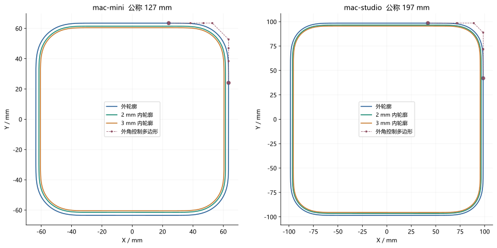
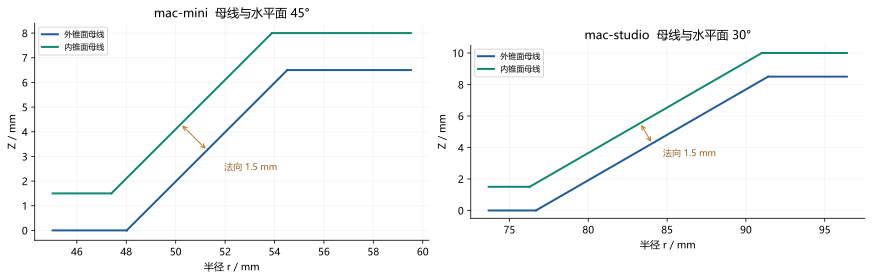
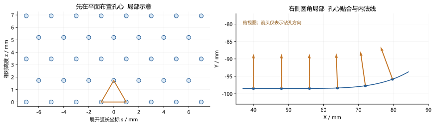

# 精确数学定义

## 怎样理解完全相同

本章给出的控制点、基函数、节点和参数区间共同定义当前曲线。按它们建立曲线即可复现相同数学对象，无需把图像描成样条，也无需再次求解优化问题。附带的 [参数文件](geometry_definition.json) 保存可往返恢复现行双精度数值的十进制表示；表格中的坐标不作展示性截断。

“相同数学曲线”不意味着不同软件生成逐字节相同的 CAD 文件。不同内核可以采用不同参数方向、插入节点或拆分曲面；浮点运算的舍入也可能不同。项目通过完整定义及原生回读检验等价性。PNG、SVG 折线预览和 CSV 采样点都是显示或交换样本，有限点集本身不唯一确定原曲线。

本章的解析公式精确定义外轮廓、理想偏移、拉伸面、圆锥和规则孔阵列。若要求逐项复现带源接口的完整 BREP，还必须使用所链接的源接口参数、已接受边界修订和规范几何数据；仅凭外轮廓公式不能恢复任意接口修剪及拓扑。

## 符号和单位

| 符号 | 定义 |
|---|---|
| $t$ | 单段曲线参数，范围 [0,1]，不是弧长 |
| $u$ | 完整闭合轮廓参数，范围 [0,8] |
| $h$ | 存储控制数据中的轮廓半宽 |
| $a$ | 第一象限上边直线与角段连接点的 X 坐标 |
| $s$ | 从指定起点累计的弧长，单位 mm |
| $d$ | 壳体的法向内偏移距离，2 或 3 mm |
| $\tau$ | 底座平板及锥壁法向厚度，1.5 mm |
| $\alpha$ | 圆锥母线与水平面的锐角 |
| $k$ | 锥面半径相对 Z 的斜率，$dr/dz=\cot\alpha$ |
| $g$ | 外侧孔口沿锥面到边界的设计距离，0.75 mm |

所有坐标默认以毫米表示。导数 $\mathbf{C}^{(r)}$ 表示对参数 $t$ 求导；只有明确写成 $d/ds$ 时才是对弧长求导。

## 第一象限外轮廓

定义七次 Bernstein 基函数：

$$B_i^7(t)=\binom{7}{i}(1-t)^{7-i}t^i,\qquad i=0,\ldots,7,\quad0\leq t\leq1.$$

第一象限角段为：

$$\mathbf{C}(t)=\sum_{i=0}^{7}B_i^7(t)\mathbf{P}_i.$$

令五个独立坐标为 $a,b,c,e,h$，控制点依次为 $(a,h),(b,h),(c,h),(e,h),(h,e),(h,c),(h,b),(h,a)$。因此也可以用下面的两个标量公式直接作图：

$$F(t)=a(1-t)^7+7bt(1-t)^6+21ct^2(1-t)^5+35et^3(1-t)^4.$$

$$G(t)=h[35t^4(1-t)^3+21t^5(1-t)^2+7t^6(1-t)+t^7].$$

$$X(t)=F(t)+G(t),\qquad Y(t)=X(1-t).$$

这些标量式与向量 Bernstein 求和完全等价。编程时可使用附带脚本中的 de Casteljau 算法，避免不必要地展开成幂基多项式。

<!-- BEGIN CONTROLS -->
### mac-mini 外角段控制点

| i | X mm | Y mm |
| --- | --- | --- |
| 0 | 24.057737854588144 | 63.50000000000001 |
| 1 | 38.389461208052055 | 63.50000000000001 |
| 2 | 46.95218406678972 | 63.50000000000001 |
| 3 | 52.77646199985835 | 63.50000000000001 |
| 4 | 63.50000000000001 | 52.77646199985835 |
| 5 | 63.50000000000001 | 46.95218406678972 |
| 6 | 63.50000000000001 | 38.389461208052055 |
| 7 | 63.50000000000001 | 24.057737854588144 |

原始拟合宽度 126.69520378112793 mm；公称统一比例 1.0024057439411727。

### mac-studio 外角段控制点

| i | X mm | Y mm |
| --- | --- | --- |
| 0 | 42.01865006037191 | 98.5 |
| 1 | 71.55478892765336 | 98.5 |
| 2 | 72.03344918554463 | 98.5 |
| 3 | 88.88585171646254 | 98.5 |
| 4 | 98.5 | 88.88585171646254 |
| 5 | 98.5 | 72.03344918554463 |
| 6 | 98.5 | 71.55478892765336 |
| 7 | 98.5 | 42.01865006037191 |

原始拟合宽度 197.0771598815918 mm；公称统一比例 0.9996084788230246。
<!-- END CONTROLS -->

曲线是非有理七次 Bézier，全部权重为 1。等价的 B 样条完整节点向量是八个 0 后接八个 1，参数区间为 [0,1]，非周期。Mini 的存储半宽为 63.50000000000001 mm，这是公称缩放后的浮点表示；逐项复现时保留该值，不要先把它改写成 63.5。公称宽度仍以设计值 127 mm 说明。

以下点可用于检查另一个程序是否采用了正确坐标、方向和尺度；它们不替代前面的控制点定义。

<!-- BEGIN CHECK_POINTS -->
| 机型 | t | X mm | Y mm |
| --- | --- | --- | --- |
| mac-mini | 0.0 | 24.057737854588144 | 63.50000000000001 |
| mac-mini | 0.25 | 43.40453847015993 | 62.656003161725664 |
| mac-mini | 0.5 | 56.17153126334827 | 56.17153126334827 |
| mac-mini | 0.75 | 62.656003161725664 | 43.40453847015993 |
| mac-mini | 1.0 | 63.50000000000001 | 24.057737854588144 |
| mac-studio | 0.0 | 42.01865006037191 | 98.5 |
| mac-studio | 0.25 | 72.66131325621667 | 97.60218023594153 |
| mac-studio | 0.5 | 89.61413605880134 | 89.61413605880134 |
| mac-studio | 0.75 | 97.60218023594153 | 72.66131325621667 |
| mac-studio | 1.0 | 98.5 | 42.01865006037191 |

完整 30 个核对点见 [reference_points.csv](reference_points.csv)，包含外轮廓及两种内轮廓。
<!-- END CHECK_POINTS -->

## 四段角曲线与四段直线

定义顺时针四分之一旋转算子 $R(x,y)=(y,-x)$。$R^0$ 为恒等，$R^2(x,y)=(-x,-y)$，$R^3(x,y)=(-y,x)$，$R^4$ 再回到恒等。

$$\mathbf{C}_q(t)=R^q\mathbf{C}(t),\qquad q=0,1,2,3.$$

$$\mathbf{L}_q(t)=(1-t)R^q\mathbf{C}(1)+tR^{q+1}\mathbf{C}(0),\qquad0\leq t\leq1.$$

完整轮廓 $\Gamma$ 按下面的八段顺序连接：

$$\Gamma(2q+t)=\mathbf{C}_q(t),\qquad\Gamma(2q+1+t)=\mathbf{L}_q(t).$$

其中 $q=0,1,2,3$，各段 $0\leq t\leq1$。共有端点处两式的位置相同，且 $\Gamma(8)=\Gamma(0)$。直线长度为 $2a$；第一象限曲线从 $(a,h)$ 走到 $(h,a)$，随后第一条直线沿右边从 $(h,a)$ 走到 $(h,-a)$。使用这个顺序可以得到一条顺时针闭合轮廓。

各段的速度不必相同，所以这套简单分段参数 $u$ 不声称在接点处具有参数 C3 连续性。要求是与重新参数化无关的几何 G3 连续性。

## 导数与 G3 的代数依据

使用前向差分 $\Delta\mathbf{P}_i=\mathbf{P}_{i+1}-\mathbf{P}_i$。对 $r=1,2,3$：

$$\mathbf{C}^{(r)}(t)=\frac{7!}{(7-r)!}\sum_{i=0}^{7-r}B_i^{7-r}(t)\Delta^r\mathbf{P}_i.$$

特别地，$\mathbf{C}'(0)=7(\mathbf{P}_1-\mathbf{P}_0)$、$\mathbf{C}''(0)=42\Delta^2\mathbf{P}_0$、$\mathbf{C}'''(0)=210\Delta^3\mathbf{P}_0$。首四点的 Y 坐标相同，因此这三个向量都沿水平方向；末四点的 X 坐标相同，因此终点的三个向量都沿竖直方向。$b>a$ 保证两端一阶导数非零。

定义 $\det(\mathbf{a},\mathbf{b})=a_xb_y-a_yb_x$。本项目采用顺时针凸曲率为正的约定，令 $\mathbf{v}=\mathbf{C}'$、$\mathbf{a}=\mathbf{C}''$、$\mathbf{j}=\mathbf{C}'''$、$v=\|\mathbf{v}\|$，则：

$$\mathbf{T}=\frac{\mathbf{v}}{v},\qquad\kappa=-\frac{\det(\mathbf{v},\mathbf{a})}{v^3}.$$

$$\frac{d\kappa}{ds}=-\frac{\det(\mathbf{v},\mathbf{j})}{v^4}+3\frac{\det(\mathbf{v},\mathbf{a})(\mathbf{v}\cdot\mathbf{a})}{v^6}.$$

单位分别为 $\kappa$ 的 $\mathrm{mm}^{-1}$ 和 $d\kappa/ds$ 的 $\mathrm{mm}^{-2}$。由于端点的一至三阶向量共线，两个行列式均为零。配合位置相接、单位切向一致及非零速度，直线与曲线两侧的曲率和曲率变化率一致，因此达到指定 G3。直线自身的曲率及其导数都为零。

对于对应的竖直挤出面，曲线接缝沿相同 Z 方向拉伸，所以同样的截面条件适用于整条竖直接缝。孔口、平板与锥面交线不属于这一证明的范围。

## 理想内偏移和实际存储的内曲线

当前轮廓按顺时针方向行进，内法线为右单位法线：

$$\mathbf{n}_{in}(t)=\frac{(Y'(t),-X'(t))}{\sqrt{X'(t)^2+Y'(t)^2}}.$$

$$\mathbf{D}_d(t)=\mathbf{C}(t)+d\mathbf{n}_{in}(t),\qquad d\in\{2,3\}\ \mathrm{mm}.$$

这一定义是恒定法向距离偏移，不能用整体缩小轮廓替代。规则偏移需保持 $1-d\kappa(t)>0$，以免出现局部尖点；当前密采样检查通过。

一般多项式 Bézier 的单位法向含平方根，偏移曲线通常不属于同次数多项式族。项目在 33 个均匀参数节点上计算理想偏移，并约束两端一至三阶导数，构造七次 B 样条；若误差不足则增加节点数。当前四种公称内轮廓都使用 33 个插值节点、39 个控制点。

最终 CAD 使用这个已接受的 B 样条 $\widehat{\mathbf{D}}_d$。要复现最终存储的内曲线，应使用参数文件里的控制点和节点，不要重新用另一个软件拟合 $\mathbf{D}_d$。

完整节点向量为八个 0，随后依次是 $1/32,2/32,\ldots,31/32$，最后八个 1。设 $U_i$ 为这个共 47 项的完整节点向量，次数 $p=7$，Cox–de Boor 基函数递推为：

$$N_{i,0}(t)=1\quad\mathrm{if}\quad U_i\leq t<U_{i+1},\qquad N_{i,0}(t)=0\quad\mathrm{otherwise}.$$

$$N_{i,p}(t)=\frac{t-U_i}{U_{i+p}-U_i}N_{i,p-1}(t)+\frac{U_{i+p+1}-t}{U_{i+p+1}-U_{i+1}}N_{i+1,p-1}(t).$$

分母为零的项定义为零。右端 $t=1$ 按左极限解释，使末控制点被插值。设控制点为 $\mathbf{Q}_i$、权重为 $w_i$，则：

$$\widehat{\mathbf{D}}_d(t)=\frac{\sum_{i=0}^{38}N_{i,7}(t)w_i\mathbf{Q}_i}{\sum_{i=0}^{38}N_{i,7}(t)w_i}.$$

当前全部 $w_i=1$。其余三个象限与直线仍按前面的 $R^q$、$\mathbf{L}_q$ 方式连接。完整的 156 个内曲线控制点保存在参数文件，也在 [完整内曲线控制表](05_INNER_CONTROLS.md) 中逐项列出。

<!-- BEGIN OFFSET_RESULTS -->
| 机型 | 壁厚 mm | 法向偏移最大差 mm | 最近距离最大差 mm | 最小 1−dκ |
| --- | --- | --- | --- | --- |
| mac-mini | 2 | 6.11663649262e-10 | 6.1097882309e-10 | 0.910750602792 |
| mac-mini | 3 | 9.17479864778e-10 | 9.16514864002e-10 | 0.866125904189 |
| mac-studio | 2 | 1.70476596783e-09 | 8.3139095608e-10 | 0.921249295023 |
| mac-studio | 3 | 2.55718040852e-09 | 1.24708199323e-09 | 0.881873942535 |
<!-- END OFFSET_RESULTS -->

表中偏移误差来自最终实体构建的验证记录，在 20001 个角段参数点上评价；最近外轮廓距离另用 4001 点检查。它不是形式化的全区间上界。CAD 包围盒包含内核容差膨胀，因此宽度可能显示设计值再加约 $2\times10^{-7}$ mm；这不应被误读成曲线控制点的设计尺寸。

## 拉伸体和壳体

对轮廓围成的闭区域记为 $\Omega$，对内轮廓围成的闭区域记为 $\Omega_d$。原高度无孔实心体为 $\Omega\times[0,H]$，1 mm 实心薄片为 $\Omega\times[0,1]$。无孔壳体从外实心体中减去 $\Omega_d\times[0,H-d]$，保留顶部厚度 $d$。

带接口壳体的未打孔形状采用同一规则，只把 Z 区间移到设计装配位置。Mini 使用 $z_c=6.5$、$H=43$；Studio 使用 $z_c=8.5$、$H=86.5$，内部切除区间为 $[z_c,z_c+H-d]$。侧面支撑参数式为：

$$\mathbf{S}(t,z)=(X(t),Y(t),z),\qquad z_c\leq z\leq z_c+H.$$

直线段也按同样方式拉伸。侧接口和通风孔随后从该实体中布尔减去，不改变外轮廓支撑曲线。

## 底座圆锥与平板

设 $r=\sqrt{x^2+y^2}$，外锥面满足 $r=r_0+kz$，其中 $k=\cot\alpha$。其参数式与外单位法线为：

$$\mathbf{K}(\theta,z)=((r_0+kz)\cos\theta,(r_0+kz)\sin\theta,z).$$

$$\mathbf{n}_{out}(\theta)=\frac{(\cos\theta,\sin\theta,-k)}{\sqrt{1+k^2}}.$$

法向间距为 $\tau$ 的内锥面满足：

$$r_{inner}(z)=r_0+kz-\tau\sqrt{1+k^2},\qquad\tau=1.5\ \mathrm{mm}.$$

Mini 取 $k=1$、$r_0=48.01857322685579$ mm、外锥面上下交界 Z 为 0 和 6.5 mm；Studio 取 $k=\sqrt{3}$、存储值 1.7320508075688772，$r_0=76.68363284099085$ mm、外交界 Z 为 0 和 8.5 mm。两者的下板分别覆盖 Z=0 至 1.5 mm，上板覆盖 Z=6.5 至 8 mm、Z=8.5 至 10 mm。

内锥面延长到下板上表面和上板上表面。这会在交界区产生允许的局部增厚，但不引入竖直圆柱过渡段。上板最外圈采用对应壳体内轮廓，中央开口由延长后的锥形空腔形成。

## Studio 背面孔心的展开与贴合

首先在平面坐标 $(s,z)$ 中布置孔心。排号 $j=0,\ldots,26$，用 $\epsilon_j=j-2\lfloor j/2\rfloor$ 表示奇偶值，即偶数排为 0、奇数排为 1。每排数量 $n_j=86-\epsilon_j$，列号 $i=0,\ldots,n_j-1$：

$$s_{ji}=2\left(i-\frac{n_j-1}{2}\right),\qquad z_j=z_m+(j-13)\sqrt{3}.$$

$$z_m=\frac{42.449631669005555+90.17018599619367}{2}\ \mathrm{mm}.$$

同排两个相邻孔心间距为 2 mm；下一排居中孔心相对它们的水平距离均为 1 mm，高差为 $\sqrt{3}$ mm，因此两腰均为 $\sqrt{1^2+(\sqrt{3})^2}=2$ mm。该排列既是等腰三角形，也是等边三角形，共 2309 个孔心。

背面位于负 Y 一侧。把第一象限曲线镜像为 $\mathbf{B}(t)=(X(t),-Y(t))$，令 $a=X(0)$，定义从背面中点起的右侧弧长坐标：

$$A(t)=a+\int_0^t\|\mathbf{C}'(v)\|\,dv.$$

当 $|s|\leq a$ 时，$\mathbf{R}(s)=(s,-h)$。当 $|s|>a$ 时，令 $t=A^{-1}(|s|)$，取 $\mathbf{R}(s)=(\operatorname{sgn}(s)X(t),-Y(t))$。三维孔心为 $\mathbf{p}_{ji}=(R_x(s_{ji}),R_y(s_{ji}),z_j)$。

这个映射保持背面中截面的弧长坐标；它不要求弯曲后的三维弦长或正视投影间距仍为 2 mm。实际代码用 32769 个参数点的 Simpson 累积积分和单调 PCHIP 反求参数，再把该参数代入 Bézier 公式。独立验收另用自适应积分和求根回算弧长。

## 等径圆柱孔的严格定义

设孔心为 $\mathbf{p}$，单位内法线为 $\mathbf{n}$，$I$ 为三维单位矩阵，半径 $r_h=0.75$ mm。圆柱侧面满足：

$$\|[I-\mathbf{n}\mathbf{n}^T](\mathbf{x}-\mathbf{p})\|^2=r_h^2.$$

用于布尔切割的圆柱体由对应的小于等于不等式定义，并限制轴向参数 $\mathbf{n}\cdot(\mathbf{x}-\mathbf{p})$ 在足够长的切穿区间内。也可取任意互相垂直且均垂直于 $\mathbf{n}$ 的单位向量 $\mathbf{e}_1,\mathbf{e}_2$ 写成：

$$\mathbf{H}(\phi,\ell)=\mathbf{p}+\ell\mathbf{n}+r_h(\cos\phi\mathbf{e}_1+\sin\phi\mathbf{e}_2).$$

半径与轴向距离 $\ell$ 无关，因此整个孔深保持相同直径。壳体曲面上的孔口是圆柱与壳面的相交曲线，其外观不一定是平面正圆；这不改变孔壁是圆柱的事实。

在 Studio 背面，$\mathbf{T}(s)=d\mathbf{R}/ds$ 为单位切向，内法线取 $(-T_y,T_x,0)$。底座孔取锥面的内法线，即前述外法线的相反数。

## Studio 底座孔圈

圈号 $j=0,\ldots,7$，每圈 244 孔。当前定义为：

$$z_j=0.75+j,\qquad\theta_{ji}=\frac{2\pi}{244}\left(i+\frac{\epsilon_j}{2}\right),\qquad i=0,\ldots,243.$$

$$\mathbf{p}_{ji}=\mathbf{K}(\theta_{ji},z_j).$$

每圈孔心 Z 相同，相邻圈错开半个角间距。数量 244 来自最小孔圈周长除以至少 2 mm 的环向弧距，向下取整后再取不大于该数的偶数。孔道按上一节固定半径圆柱定义。

沿一条锥面母线，距离增量为 $ds=\sqrt{1+k^2}\,dz$。最下圈中心与下边界的沿面距离是 1.5 mm，再减孔半径 0.75 mm 得到孔口边距 0.75 mm；最上圈同理。实际外孔口边缘还从最终 BREP 独立求极值核验，避免只验证设计孔心表。

## Mini 底座长圆孔

孔数为 108，角度 $\theta_i=\theta_0+2\pi i/108$。相位 $\theta_0$ 来自保留的源孔环拟合，其完整值见参数文件中的 `mini_vents.phase_radians`，不能任意把第一孔放在 X 轴上。

<!-- BEGIN MINI_PHASE -->
当前相位为 `-2.6516629904901536e-05` rad，角间距为 `0.05817764173314432` rad。
<!-- END MINI_PHASE -->

孔心位于外锥面 Z=3.25 mm。单位环向向量为 $\mathbf{e}_\theta=(-\sin\theta,\cos\theta,0)$，单位母线方向为 $\mathbf{e}_g=(k\cos\theta,k\sin\theta,1)/\sqrt{1+k^2}$。在孔心切平面上使用坐标 $(u,v)$，分别沿 $\mathbf{e}_\theta$、$\mathbf{e}_g$。

槽宽 $w=2$ mm，端部半径 $r_s=1$ mm，总长：

$$L=6.5\sqrt{2}-2g\approx7.692388155425119\ \mathrm{mm},\qquad a_s=(L-w)/2.$$

长圆形截面可由以下不等式精确定义：

$$u^2+\max(|v|-a_s,0)^2\leq r_s^2.$$

它由中间矩形与两端半圆组成。把这个截面沿孔心处锥面法线拉伸，再从底座中减去，得到法向长圆孔。中心到上下外锥面交界的沿面距离减去 $L/2$ 后均为 0.75 mm。实际检查同时要求通风孔不穿入上下水平外表面，按钮孔作为独立功能孔保留。

## 完整接口和拓扑的补充定义

侧接口不都属于上述规则孔阵列。它们的边界来自 `model_parameters.json` 中的 `side_apertures` 和关联源记录，构建时转成光滑闭合曲线并贯穿设计壁厚。若需要逐个端口的精确控制点、边方向、二维修剪曲线与面关联，以当前发布清单引用的 `canonical.geometry.json` 为完整表示。

参数公式负责定义曲线和支撑；BREP 还需规定支撑被哪些边界裁剪、哪些面围成闭合实体以及实体之间的装配位置。当前装配包含独立的壳体与底座两个实体，使用恒等装配位置。文档中的独立复现脚本集中复现公共外轮廓和实际存储的内轮廓；完整实体应通过项目的正式构建入口重建和验收。

依据：[公共控制点](../../data/fitted_profiles.json)、[真实偏移实现](../../enclosure/wall_offset.py)、[背孔映射](../../enclosure/rear_profile.py)、[底孔阵列](../../enclosure/studio_base_pattern.py)、[长圆孔](../../enclosure/mini_capsules.py)、[规范几何清单](../../exact_delivery_manifest.json)。
